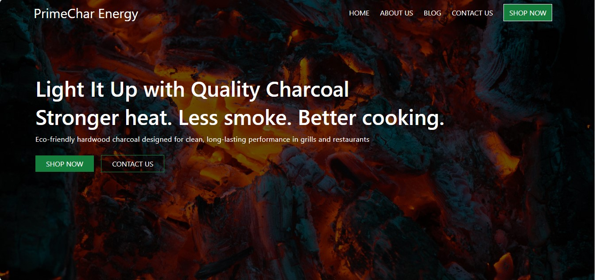

# PrimeChar Energy Landing Page

A modern and responsive landing page for **PrimeChar Energy**, a charcoal brand focused on quality, clean burning, and reliable energy solutions.

---

## 🚀 Live Demo

[View Live Site](Not yet)

---

## 📸 Preview



---

## ✨ Features

- Responsive design
- Modern UI layout
- Hero section
- About section
- Product Overview
- Customer testimonials
- Contact section
- Mobile-friendly navigation
- Smooth scrolling experience

---

## 🛠️ Built With

- HTML5
- Tailwind CSS
- JavaScript

---

## 📂 Project Structure

```bash
PrimeChar-Energy/
│
├── index.html
├── input.css
├── js/
│   └── script.js
├── images/
│   ├── hero-image.jpg
│   └── preview.png
│
└── README.md
```

---

## ⚙️ Installation

Clone the repository:

```bash
git clone https://github.com/femight05/PrimeChar_Energy
```

Move into the project folder:

```bash
cd PrimeChar-Energy
```

Run the project using Live Server or open `index.html` in your browser.

---

## 📱 Responsive Design

The landing page is optimized for:

- Mobile devices
- Tablets
- Laptops
- Desktop screens

---

## 🎯 Goals of the Project

This project was built to:

- Practice responsive web design
- Improve Tailwind CSS skills
- Build a modern landing page
- Strengthen frontend development experience

---

## 📌 Future Improvements

- Dark mode support
- Animation effects
- Backend contact form integration
- Product ordering section
- Multi-page expansion

---

## 👨‍💻 Author

**Oluwafemi Akinpelu**

- GitHub: https://github.com/femight05
- X (Twitter): https://x.com/AkinpeluFemi5

---

## 📄 License

This project is open source and available under the MIT License.